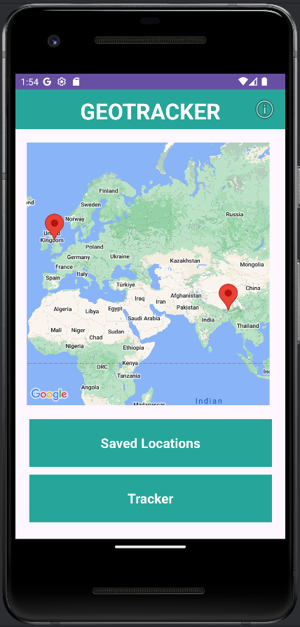
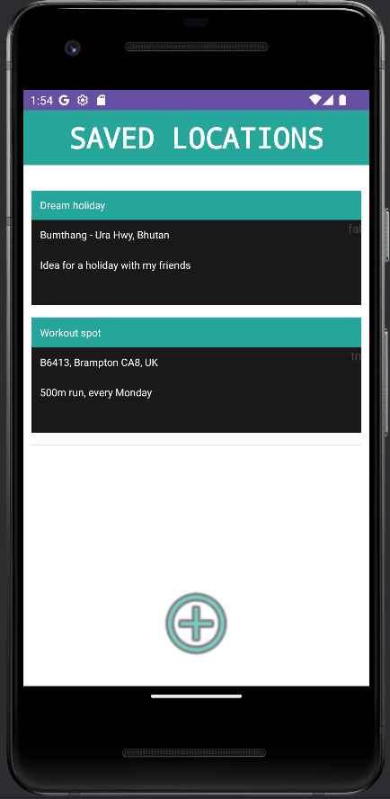

# Location Tracker

An Android utility app that enables users to set markers at any location in the world, a small project to develop my Java and data handling proficiency.

## Features
### SAVED LOCATIONS 
- Displays list of saved locations
- Locations can be added by pressing "+" below
- Locations can be set by clicking on the map and have a title, description and  a reminder set for them
### TRACKER 
- Allows user to set different movement options to track
- Tracking will also notify user if they are within 100m of a location if a reminder was set
- Displays movement statistics

 

## Images

